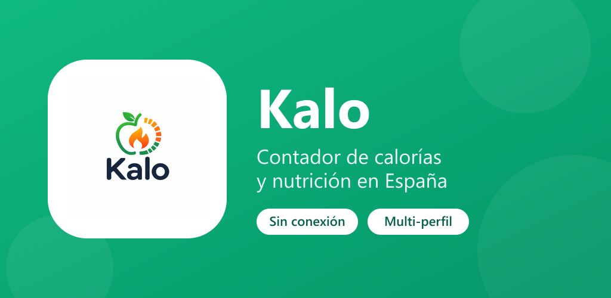
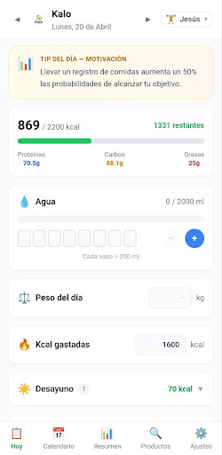
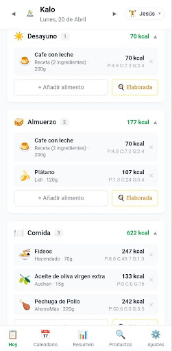
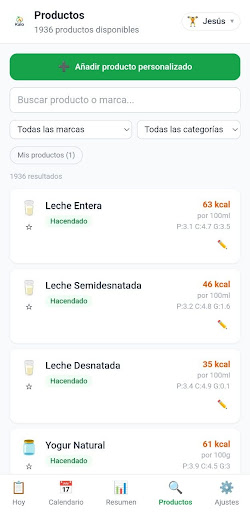
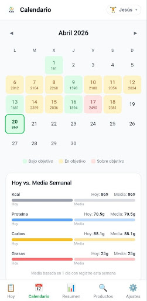
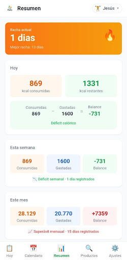
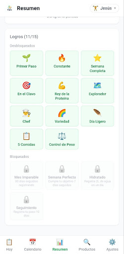
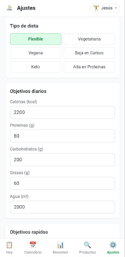
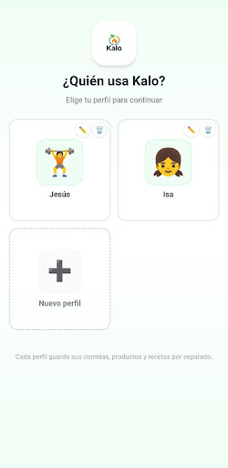

<p align="center">
  
</p>

<h1 align="center">Kalo 🥗</h1>

<p align="center">
  <b>Contador de calorías y macros pensado para España.</b><br/>
  Offline, sin cuentas, sin tracking, sin anuncios.
</p>

<p align="center">
  
  
  
  
  
</p>

<p align="center">
  <a href="https://tabutaje.github.io/Kalo-app/"></a>
  <a href="https://github.com/tabutaje/Kalo-app/releases/latest"></a>
</p>

---

Registra lo que comes buscando productos reales de **Mercadona, Lidl, Carrefour, Dia, Aldi, Eroski, AhorraMás, Alcampo, Consum, Hipercor** y muchos más supermercados españoles — la información nutricional ya viene cargada, solo eliges la cantidad.

### ✨ Características

- 🇪🇸 **Miles de productos españoles** con valores nutricionales reales precargados
- 📊 **Objetivos diarios** de calorías, proteínas, carbohidratos y grasas
- 🧑‍🤝‍🧑 **Multi-perfil** para toda la familia, cada uno con su avatar (foto o emoji)
- 🍳 **Recetas y productos personalizados** que puedes añadir tú
- 📅 **Calendario mensual** y dashboard semanal con tu progreso
- 🔒 **Privacidad total**: todo se guarda en tu dispositivo, sin cuentas, sin tracking, sin anuncios
- 📴 **Funciona 100% sin conexión**

### 📱 Capturas

<p align="center">
  
  
  
  
</p>
<p align="center">
  
  
  
  
</p>

### 📥 Descarga

- **🌐 Versión web**: [tabutaje.github.io/Kalo-app](https://tabutaje.github.io/Kalo-app/) — funciona en cualquier navegador, sin instalar nada
- **🤖 APK directo**: [última release](https://github.com/tabutaje/Kalo-app/releases/latest) (descárgalo y ábrelo en tu Android)
- **▶️ Google Play Store**: *próximamente* (en revisión)

---

## Stack técnico

- **Frontend**: React 19 + TypeScript + Vite 6 + Tailwind CSS 3
- **Móvil**: Capacitor 8 (Android + iOS)
- **Persistencia**: `localStorage` con soporte multi-perfil
- **Routing**: React Router (HashRouter)

## Estructura del proyecto

```
Kalo/
├── src/                          # Código fuente React
│   ├── pages/                    # Páginas (DailyLog, Dashboard, etc.)
│   ├── components/               # Componentes reutilizables
│   ├── context/                  # Contextos (AppContext, ShellContext)
│   ├── data/                     # Base de datos de productos seed
│   ├── types/                    # Tipos TypeScript
│   └── utils/                    # Utilidades (nutrition, storage, dates)
├── android/                      # Proyecto Android (Capacitor)
├── ios/                          # Proyecto iOS (Capacitor)
├── scripts/                      # Scripts auxiliares (gen-splash.cjs)
├── public/                       # Assets estáticos (logo, favicon)
├── play-store-assets/            # Material para Google Play
├── build-aab.ps1                 # Genera App Bundle firmado
├── build-apk.ps1                 # Genera APK firmado
└── capacitor.config.ts           # Configuración Capacitor
```

## Desarrollo local

Requisitos: **Node.js 20+**, **Java JDK 21+** (incluido con Android Studio), **Android Studio** con SDK 36.

```bash
# Instala dependencias
npm install

# Arranca en modo dev (navegador)
npm run dev

# Compila el bundle web
npm run build

# Sincroniza cambios al proyecto Android
npx cap sync android

# Abre Android Studio
npx cap open android
```

## Compilar APK / AAB firmado

Necesitas un keystore Android. Si no tienes uno:

```bash
keytool -genkey -v -keystore kalo-release-key.jks -keyalg RSA -keysize 2048 -validity 10000 -alias kalo
```

Copia `android/keystore.properties.example` a `android/keystore.properties` y rellena los valores:

```properties
storeFile=../../kalo-release-key.jks
storePassword=tu_password
keyAlias=tu_alias
keyPassword=tu_password
```

Luego genera el build (en Windows con PowerShell):

```powershell
# APK (para instalar directo en un móvil o sideload)
powershell -ExecutionPolicy Bypass -File .\build-apk.ps1

# AAB (obligatorio para subir a Google Play Store)
powershell -ExecutionPolicy Bypass -File .\build-aab.ps1
```

El artefacto firmado aparecerá en `android/app/build/outputs/apk/release/app-release.apk` (o `bundle/release/app-release.aab`).

## Privacidad

Kalo **no recoge ningún dato personal**. Todo se almacena localmente en el dispositivo. Puedes consultar la política completa en [`play-store-assets/Readme.md`](play-store-assets/Readme.md).

## Licencia

MIT — consulta el archivo [`LICENSE`](LICENSE) para los detalles.

---

Hecho con cariño en España 🇪🇸
